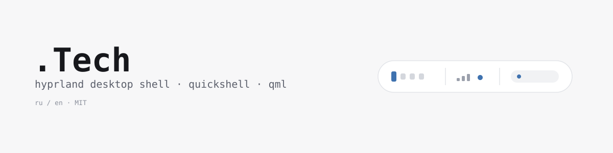
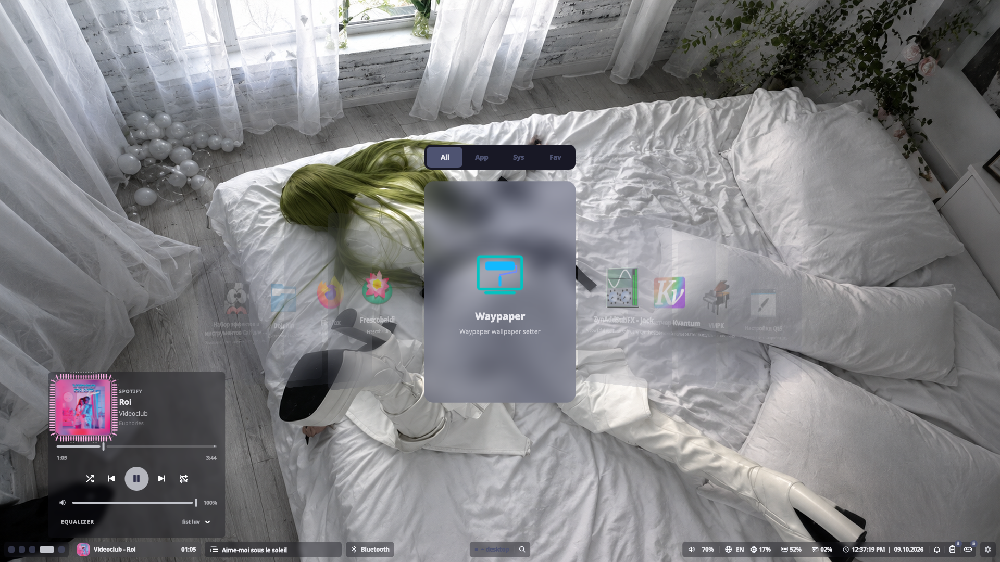
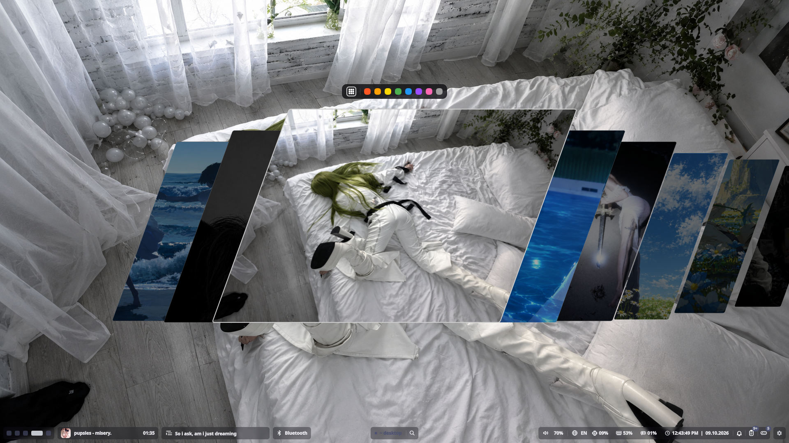

<div align="center">

# .Tech

**Мой шелл для Hyprland на Quickshell**
*My Hyprland desktop shell, built on Quickshell*

<picture>
  <source media="(prefers-color-scheme: dark)" srcset="assets/Screens/banner-dark.svg">
  <source media="(prefers-color-scheme: light)" srcset="assets/Screens/banner-light.svg">
  
</picture>


[](LICENSE)
[](https://hypr.land)
[](https://quickshell.org)

[Русский](#русский) · [English](#english)

</div>

<!-- Добавь скриншот:  -->






---

## Русский

### Что это

`.Tech` — рабочий стол для [Hyprland](https://hypr.land), целиком на QML и [Quickshell](https://quickshell.org). Панель, всплывающие окошки, лаунчеры, уведомления, настройки. Есть русский и английский.

Я делаю его под себя и выкладываю как есть, так что углы местами шершавые. Нашёл баг или есть идея — заводи [issue](https://github.com/22miligrams-cmyk/.Tech/issues), мне важно.

### Что нужно, чтобы это завелось

- **Hyprland 0.55+** (с этой версии конфиг на Lua, `hyprland.lua`; старый `hyprland.conf` тоже работает)
- **Quickshell**
- Wayland и PipeWire

Остальное установщик проверит сам и предложит доставить: `git`, `curl`, `jq`, `python3`, `wireplumber`, `pavucontrol`, `blueman`, `xdg-utils`, `fontconfig`, `qt6-shadertools` и шрифт **JetBrainsMono Nerd Font** (без него вместо иконок будут квадратики).

### Установка

Одной командой:

```bash
curl -fsSL https://raw.githubusercontent.com/22miligrams-cmyk/.Tech/main/install.sh | bash
```

Если не хочешь запускать что попало из интернета (и правильно), скачай `install.sh`, прочитай и запусти: `bash install.sh`.

**Как это пройдёт:**

1. Выбираешь язык: русский или English.
2. Установщик смотрит, какой у тебя дистрибутив (Arch, Debian/Ubuntu, Fedora, openSUSE) и какая версия Hyprland.
3. Показывает, чего не хватает. ✔ — есть, ✘ — нет, но поставлю, ! — в репозиториях нет, ставь руками.
4. Появляется меню шагов. Стрелки ↑↓ двигают, **пробел** включает и выключает пункт, **Enter** запускает. Что уже сделано (шрифт, цвета…), помечено и пропускается.
5. Дальше он сам: ставит пакеты, качает шелл в `~/.tech/shell`, собирает шейдеры, создаёт стартовые цвета, добавляет автозапуск и запускает шелл.
6. Один вопрос по дороге: **проверять ли обновления автоматически**. Потом это можно поменять (см. «Обновление»).

> `quickshell` на разных системах ставится по-разному. Arch: из репозиториев или AUR (`yay`/`paru`). Fedora: из COPR `errornr/quickshell`. Debian/Ubuntu: в репозиториях его нет, придётся ставить руками по [инструкции](https://quickshell.org).

**Флаги установщика**

| Флаг | Что делает |
|---|---|
| `-y`, `--yes` | без вопросов, всё автоматически |
| `--dry-run` | ничего не менять, только показать, что будет |
| `--auto-update` / `--no-auto-update` | сразу включить или выключить проверку обновлений |
| `-h`, `--help` | справка |

Через `curl | bash` флаги передаются так: `curl -fsSL …/install.sh | bash -s -- -y`

**Переменные:** `TECH_LANG=ru` или `en` (язык без вопроса), `TECH_DIR=/путь` (куда ставить, по умолчанию `~/.tech/shell`).

### Обновление

Шелл сам следит за новыми версиями, тебе почти ничего делать не надо.

**Как он узнаёт о новой версии**
- через 20 секунд после запуска и потом раз в несколько часов сравнивает твой `v.version` с тем, что на GitHub;
- **каждый раз, когда ты открываешь настройки**, тихо проверяет ещё раз (без уведомлений, просто чтобы показать свежий статус).

**Что ты увидишь**
- Вышла новая версия — прилетит уведомление «Йоу, есть апдейт!». Оно **пробивает «Не беспокоить»**, чтобы ты точно заметил. Напомнит оно один раз за запуск шелла, пока не обновишься.
- Открой настройки: первая карточка **«О шелле»** показывает версию, статус и ссылки.
  - Есть обновление — на ней кнопка **«Обновить до N»**. Нажимаешь, открывается терминал с установщиком, он всё сделает.
  - Всё свежее — там написано «✓ Всё ок, последняя версия».

**Если не хочешь, чтобы шелл лез на GitHub сам**, выключи автопроверку (ручная проверка и карточка «О шелле» продолжат работать):

```bash
quickshell ipc -p ~/.tech/shell call updater autoOff   # выключить
quickshell ipc -p ~/.tech/shell call updater autoOn    # включить обратно
```

**Остальные команды**

```bash
quickshell ipc -p ~/.tech/shell call updater check     # проверить прямо сейчас
quickshell ipc -p ~/.tech/shell call updater status    # что сейчас известно о версиях
quickshell ipc -p ~/.tech/shell call updater apply     # открыть терминал и запустить установщик
quickshell ipc -p ~/.tech/shell call updater autoToggle
```

Настройки (автопроверка, период в часах) лежат в `~/.cache/qs-updater/state.json`.

**Обновить можно и вручную:** просто запусти установщик ещё раз.
- версии совпали — предложит выйти или переустановить;
- на GitHub новее — предложит обновиться (новая копия скачается рядом, и только потом заменит старую, поэтому обрыв интернета ничего не сломает);
- GitHub недоступен — сделает обычный `git pull`.

⚠️ Если ты правил файлы шелла руками, при обновлении они **пропадут**. Установщик предупредит об этом.

Перезапустить шелл: `pkill -x quickshell && quickshell -d -p ~/.tech/shell`

### Автозапуск

Установщик добавляет его сам (и делает бэкап `*.bak-<дата>`). Руками это выглядит так.

**Hyprland 0.55+, `~/.config/hypr/hyprland.lua`:**

```lua
hl.on("hyprland.start", function()
  hl.exec_cmd("quickshell -p '/home/USER/.tech/shell'")
end)
```

**Старый формат, `~/.config/hypr/hyprland.conf`:**

```ini
exec-once = quickshell -p '/home/USER/.tech/shell'
```

### Ручная установка

Без установщика:

1. Поставь зависимости и JetBrainsMono Nerd Font.
2. Склонируй репозиторий:
   ```bash
   git clone https://github.com/22miligrams-cmyk/.Tech.git ~/.tech/shell
   ```
3. Собери шейдеры:
   ```bash
   cd ~/.tech/shell
   find . -type f \( -name '*.frag' -o -name '*.vert' \) -exec sh -c 'qsb --qt6 -o "$1.qsb" "$1"' _ {} \;
   ```
4. Положи стартовые цвета в `~/.cache/quickshell/colors.json`:
   ```json
   {
     "bg": "#181825",
     "accent": "#a3cef1",
     "text": "#e0e1dd",
     "secondary": "#3d5a80"
   }
   ```
5. Запусти: `quickshell -d -p ~/.tech/shell`

### Цвета

Палитра берётся из `~/.cache/quickshell/colors.json` (ключи `bg`, `accent`, `text`, `secondary`). Поменял значения — цвета обновились.

### Что где лежит

```
shell.qml        точка входа
Bar.qml          панель
Logic.qml        логика и состояние
Visual.qml       сборка интерфейса
v.version        версия (по ней работает обновление)
assets/ icons/   ресурсы и иконки
bar/ panels/     панель и всплывающие окошки
launchers/       лаунчеры
notifications/   уведомления
settings/        настройки (в том числе карточка «О шелле»)
updater/         проверка и установка обновлений
lang/            переводы (LangRu.qml, LangEn.qml)
lrc/             тексты песен
common/          общие компоненты
```

### Если что-то не работает

| Проблема | Что делать |
|---|---|
| Шелл не стартует или выглядит криво | Запусти без `-d`, ошибки QML будут видны: `quickshell -p ~/.tech/shell` |
| Вместо иконок квадратики | Нет JetBrainsMono Nerd Font. Запусти установщик ещё раз |
| Не хватает пакета | Запусти установщик ещё раз, он покажет, чего нет |
| Шейдеры не собрались | Поставь `qsb` (пакет `qt6-shadertools`) |
| Шелл не стартует при входе | Проверь, что в `hyprland.lua` или `hyprland.conf` есть строка с `quickshell` |
| Обновление не показывается | `quickshell ipc -p ~/.tech/shell call updater check`, потом `… call updater status`. Если пишет `error`, шелл не достучался до GitHub |
| `ipc` пишет «could not find config» | Используй `-p ~/.tech/shell`, как в примерах выше |

### Для тех, кто форкает или выпускает обновления

Обновление срабатывает, когда число в `v.version` на GitHub **больше**, чем у пользователя. Поэтому, чтобы выпустить версию:

```bash
echo 4 > v.version
git add -A
git commit -m "что изменилось"
git pull --rebase origin main && git push origin main
```

`install.sh` лежит в корне репозитория, но в `~/.tech/shell` не копируется. Если правишь его, добавляй с флагом: `git add --sparse install.sh`.

### Удаление

```bash
pkill -x quickshell
rm -rf ~/.tech/shell ~/.cache/qs-updater
rm -f ~/.config/quickshell/tech
```

И убери блок `.Tech shell` из `hyprland.lua` или `hyprland.conf`. Бэкапы `.bak-<дата>` лежат рядом, можно просто вернуть.

### Лицензия

[MIT](LICENSE)

---

## English

### What is this

`.Tech` is a desktop shell for [Hyprland](https://hypr.land), written entirely in QML on [Quickshell](https://quickshell.org): bar, popup panels, launchers, notifications, settings. The UI comes in Russian and English.

I build it for myself and share it as is, so some edges are rough. Found a bug or have an idea? Open an [issue](https://github.com/22miligrams-cmyk/.Tech/issues).

### What you need

- **Hyprland 0.55+** (the config is Lua, `hyprland.lua`, from that version; the old `hyprland.conf` still works)
- **Quickshell**
- Wayland and PipeWire

The installer checks everything else and offers to install what's missing: `git`, `curl`, `jq`, `python3`, `wireplumber`, `pavucontrol`, `blueman`, `xdg-utils`, `fontconfig`, `qt6-shadertools`, plus **JetBrainsMono Nerd Font** (without it icons show up as boxes).

### Install

One command:

```bash
curl -fsSL https://raw.githubusercontent.com/22miligrams-cmyk/.Tech/main/install.sh | bash
```

Or download `install.sh`, read it, and run `bash install.sh`.

**What happens:**

1. You pick a language.
2. It detects your distro (Arch, Debian/Ubuntu, Fedora, openSUSE) and Hyprland version.
3. It shows what's missing. ✔ found, ✘ missing and will be installed, ! not in the repos, install by hand.
4. A step menu appears: **↑↓** to move, **Space** to toggle, **Enter** to start. Steps already done are marked and skipped.
5. Then it installs packages, downloads the shell to `~/.tech/shell`, builds shaders, creates starter colors, adds autostart and launches the shell.
6. One question on the way: **check for updates automatically?** You can change it later (see "Updates").

`quickshell` comes from the repos or AUR on Arch, from the `errornr/quickshell` COPR on Fedora, and has to be installed by hand on Debian/Ubuntu (see the [instructions](https://quickshell.org)).

**Flags:** `-y` / `--yes` (no questions), `--dry-run` (change nothing, just show), `--auto-update` / `--no-auto-update` (answer the update question up front), `--help`. With `curl | bash`: `… | bash -s -- -y`.
**Env:** `TECH_LANG=ru|en`, `TECH_DIR=<install dir>`.

### Updates

The shell watches for new versions itself, so you rarely have to do anything.

**How it finds out**
- 20 seconds after start, and then every few hours, it compares your `v.version` with the one on GitHub;
- **every time you open Settings** it quietly checks again (no notification, just to show a fresh status).

**What you'll see**
- A new version is out: you get a "Yo, there's an update!" notification. It **breaks through Do Not Disturb** so you don't miss it, and it reminds you once per shell launch until you update.
- Open Settings: the first card, **About**, shows the version, the status and some links.
  - Update available: it has an **"Update to N"** button. Click it and a terminal opens with the installer, which does the rest.
  - Up to date: it says "✓ All good, latest version".

**Don't want the shell to contact GitHub on its own?** Turn auto-check off (manual check and the About card keep working):

```bash
quickshell ipc -p ~/.tech/shell call updater autoOff
quickshell ipc -p ~/.tech/shell call updater autoOn
```

**Other commands**

```bash
quickshell ipc -p ~/.tech/shell call updater check    # check right now
quickshell ipc -p ~/.tech/shell call updater status   # what is known about versions
quickshell ipc -p ~/.tech/shell call updater apply    # open a terminal and run the installer
```

Settings (auto-check, interval in hours) live in `~/.cache/qs-updater/state.json`.

**Manual update:** just run the installer again. Same version: it offers to exit or reinstall. GitHub is newer: it offers to update (the new copy is downloaded first and replaces the old one only after that). GitHub unreachable: plain `git pull`.

⚠️ Local edits to the shell files are **lost** on update. The installer warns you.

Restart the shell: `pkill -x quickshell && quickshell -d -p ~/.tech/shell`

### Autostart (manual)

The installer adds it for you (with a backup). By hand:

```lua
-- ~/.config/hypr/hyprland.lua  (Hyprland 0.55+)
hl.on("hyprland.start", function()
  hl.exec_cmd("quickshell -p '/home/USER/.tech/shell'")
end)
```

```ini
# ~/.config/hypr/hyprland.conf  (legacy)
exec-once = quickshell -p '/home/USER/.tech/shell'
```

### Troubleshooting

- Run the shell without `-d` to see QML errors: `quickshell -p ~/.tech/shell`
- Boxes instead of icons: JetBrainsMono Nerd Font is missing, run the installer again.
- Shaders not built: install `qsb` (`qt6-shadertools`).
- No update showing: run `… call updater check`, then `… call updater status`. `error` means GitHub couldn't be reached.
- `ipc` says it could not find the config: use `-p ~/.tech/shell` as in the examples.

### Releasing an update (for forks and for me)

An update triggers when the number in `v.version` on GitHub is **greater** than the user's:

```bash
echo 4 > v.version
git add -A
git commit -m "what changed"
git pull --rebase origin main && git push origin main
```

`install.sh` lives in the repo root but is not copied into `~/.tech/shell`; add it with `git add --sparse install.sh`.

### Uninstall

```bash
pkill -x quickshell
rm -rf ~/.tech/shell ~/.cache/qs-updater
rm -f ~/.config/quickshell/tech
```

Then remove the `.Tech shell` block from `hyprland.lua` / `hyprland.conf` (backups named `.bak-<date>` are right next to them).

### License

[MIT](LICENSE)
